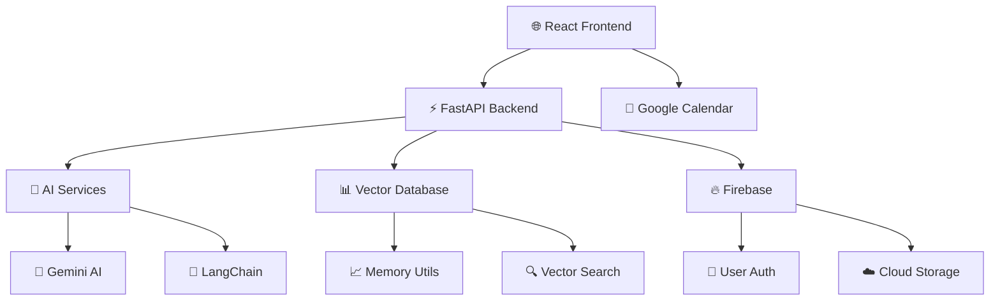

# 🎯 StudyMentor AI
### *Your Intelligent Learning Companion* 🚀

<div align="center">


**Transform your learning journey with AI-powered study plans, interactive quizzes, and smart calendar integration** 📚✨

[](https://reactjs.org/)
[](https://fastapi.tiangolo.com/)
[](https://tailwindcss.com/)
[](https://python.org/)

</div>

---

## 🌟 **What is StudyMentor?**

StudyMentor is an **AI-powered learning platform** that revolutionizes how you study and organize your learning journey. Whether you're a student, professional, or lifelong learner, StudyMentor adapts to your needs and creates personalized study experiences.

### 🎭 **Core Philosophy**
> *"Learning should be intelligent, personalized, and effortlessly organized"*

---

## ✨ **Key Features**

### 🧠 **AI-Powered Study Plans**
- 📋 **Smart Planning**: Generate comprehensive study schedules tailored to your goals
- ⏰ **Time Management**: Optimized daily and weekly study sessions
- 🎯 **Goal-Oriented**: Focused plans that align with your learning objectives
- 📊 **Progress Tracking**: Monitor your advancement through structured milestones

### 📚 **Intelligent Syllabus Parser**
- 📄 **PDF Analysis**: Upload syllabus PDFs and get AI-powered breakdowns
- 🔍 **Topic Extraction**: Automatically identify key subjects and topics
- 📈 **Difficulty Assessment**: Smart prioritization based on complexity
- 🗂️ **Structured Organization**: Clean, organized study materials

### 🧩 **Interactive Quiz Generator**
- ❓ **Dynamic Questions**: AI-generated quizzes based on your study materials
- 🎲 **Multiple Formats**: Multiple choice, true/false, and open-ended questions
- 📊 **Instant Feedback**: Real-time scoring and explanations
- 🔄 **Adaptive Learning**: Questions adjust to your knowledge level

### 💾 **Smart Flashcards**
- 🃏 **Auto-Generation**: Create flashcards from your study content
- 🔄 **Spaced Repetition**: Scientifically-backed review intervals
- 🎨 **Beautiful Design**: Clean, distraction-free interface
- 📱 **Study Anywhere**: Responsive design for all devices

### 📅 **Google Calendar Integration**
- 🗓️ **Seamless Sync**: Add study sessions directly to Google Calendar
- ⏰ **Smart Scheduling**: Morning (9 AM-12 PM) and afternoon (2 PM-5 PM) sessions
- 🔔 **Reminders**: 30-minute notification alerts
- 📱 **Multiple Options**: Direct links or downloadable calendar files

---

## 🏗️ **Architecture Overview**



### 🎨 **Frontend Stack**
- **⚛️ React 19.1.1** - Modern UI framework with latest features
- **🎭 Framer Motion** - Smooth animations and transitions  
- **🎨 TailwindCSS 3.4** - Utility-first styling framework
- **🧭 React Router** - Client-side routing
- **⚡ Vite** - Lightning-fast build tool
- **🎯 Lucide React** - Beautiful icon system

### 🔧 **Backend Stack**
- **🚀 FastAPI** - High-performance Python web framework
- **🤖 Google Gemini AI** - Advanced language model integration
- **🔗 LangChain** - AI application development framework
- **🔥 Firebase** - Authentication and cloud storage
- **📊 Vector Database** - Intelligent content search and retrieval
- **📅 Google Calendar API** - Calendar integration services

---

## 🚀 **Quick Start Guide**

### 📋 **Prerequisites**
- **Python 3.10+** 🐍
- **Node.js 18+** 📦
- **Google API Keys** 🔑
- **Firebase Project** 🔥

### 🔧 **Installation**

#### 1️⃣ **Clone the Repository**
```bash
git clone https://github.com/viraj-gavade/StudyMentor-AI.git
cd StudyMentor-AI
```

#### 2️⃣ **Backend Setup**
```bash
# Navigate to backend directory
cd Backend

# Create virtual environment
python -m venv studymentor_env

# Activate virtual environment
# Windows:
studymentor_env\Scripts\activate
# macOS/Linux:
source studymentor_env/bin/activate

# Install dependencies
pip install -r requirements.txt

# Set up environment variables
cp utils/.env.example utils/.env
# Edit utils/.env with your API keys
```

#### 3️⃣ **Frontend Setup**
```bash
# Navigate to frontend directory
cd my-app

# Install dependencies
npm install

# Start development server
npm run dev
```

#### 4️⃣ **Start the Backend**
```bash
# In Backend directory
python app.py
```

### 🌐 **Access the Application**
- **Frontend**: http://localhost:5173 🎨
- **Backend API**: http://localhost:8000 ⚡
- **API Documentation**: http://localhost:8000/docs 📚

---

## 🔐 **Environment Configuration**

### 📝 **Backend Environment Variables**
Create `Backend/utils/.env`:

```env
# 🤖 AI Configuration
GOOGLE_API_KEY=your_gemini_api_key_here

# 🔥 Firebase Configuration  
FIREBASE_PROJECT_ID=your_firebase_project_id
FIREBASE_PRIVATE_KEY=your_firebase_private_key
FIREBASE_CLIENT_EMAIL=your_firebase_client_email

# 📅 Google Calendar API
GOOGLE_CALENDAR_CLIENT_ID=your_google_calendar_client_id
GOOGLE_CALENDAR_CLIENT_SECRET=your_google_calendar_client_secret

# 🗃️ Database Configuration
MONGODB_URL=your_mongodb_connection_string

# 🔒 Security
JWT_SECRET_KEY=your_jwt_secret_key
```

### 🔑 **Getting API Keys**

#### 🤖 **Google Gemini AI**
1. Visit [Google AI Studio](https://makersuite.google.com/app/apikey)
2. Create a new API key
3. Add to `GOOGLE_API_KEY` in `.env`

#### 🔥 **Firebase Setup**
1. Go to [Firebase Console](https://console.firebase.google.com/)
2. Create a new project
3. Enable Authentication and Firestore
4. Download service account key
5. Add credentials to `.env`

#### 📅 **Google Calendar API**
1. Visit [Google Cloud Console](https://console.cloud.google.com/)
2. Enable Google Calendar API
3. Create OAuth 2.0 credentials
4. Add client ID and secret to `.env`

---

## 🎯 **Usage Examples**

### 📚 **Creating a Study Plan**
```javascript
// Example API call
const studyPlan = await fetch('/api/study-plan/generate', {
  method: 'POST',
  headers: { 'Content-Type': 'application/json' },
  body: JSON.stringify({
    subjects: ['Python', 'Data Structures', 'Algorithms'],
    duration: 30, // days
    daily_hours: 3,
    difficulty: 'intermediate'
  })
});
```

### 🧩 **Generating Quizzes**
```javascript
// Generate quiz from topics
const quiz = await fetch('/api/quiz/generate', {
  method: 'POST',
  body: JSON.stringify({
    topic: 'Python Functions',
    difficulty: 'medium',
    question_count: 10
  })
});
```

### 📅 **Calendar Integration**
```javascript
// Add study sessions to Google Calendar  
const calendarSync = await fetch('/api/calendar/sync', {
  method: 'POST',
  body: JSON.stringify({
    study_plan_id: 'plan_123',
    start_date: '2025-09-22'
  })
});
```

---

## 📁 **Project Structure**

```
StudyMentor/
├── 🎨 my-app/                    # React Frontend
│   ├── src/
│   │   ├── components/           # React Components
│   │   │   ├── StudyPlanGenerator.jsx
│   │   │   ├── QuizGenerator.jsx
│   │   │   ├── FlashcardGenerator.jsx
│   │   │   ├── CalendarIntegration.jsx
│   │   │   └── SyllabusPdfParser.jsx
│   │   ├── utils/               # Frontend Utilities
│   │   ├── assets/              # Static Assets
│   │   └── main.jsx            # App Entry Point
│   ├── package.json
│   └── vite.config.js
│
├── 🔧 Backend/                  # FastAPI Backend
│   ├── utils/                   # Core Utilities
│   │   ├── llm_utils.py        # AI Integration
│   │   ├── quiz_utils.py       # Quiz Generation
│   │   ├── studyplan_utils.py  # Study Planning
│   │   ├── calendar_utils.py   # Calendar Sync
│   │   ├── firebase_utils.py   # Firebase Integration
│   │   └── vector_utils.py     # Vector Search
│   ├── routers/                 # API Routes
│   ├── middleware/              # Custom Middleware
│   ├── app.py                  # FastAPI Entry Point
│   └── requirements.txt
│
├── 📚 Documentation/
│   ├── GOOGLE_CALENDAR_SETUP.md
│   └── SIMPLE_CALENDAR_README.md
│
└── 📝 README.md
```

---

## 🛠️ **API Endpoints**

### 📊 **Study Plans**
- `POST /api/study-plan/generate` - Generate AI study plan
- `GET /api/study-plan/{plan_id}` - Get specific study plan
- `PUT /api/study-plan/{plan_id}` - Update study plan

### 🧩 **Quizzes**
- `POST /api/quiz/generate` - Generate quiz questions
- `POST /api/quiz/submit` - Submit quiz answers
- `GET /api/quiz/results/{quiz_id}` - Get quiz results

### 📚 **Syllabus**
- `POST /api/syllabus/parse` - Parse PDF syllabus
- `GET /api/syllabus/topics` - Get extracted topics

### 📅 **Calendar**
- `POST /api/calendar/sync` - Sync to Google Calendar
- `GET /api/calendar/status` - Check sync status

### 💾 **Flashcards**
- `POST /api/flashcards/generate` - Generate flashcards
- `GET /api/flashcards/{set_id}` - Get flashcard set

---

## 🎨 **Screenshots & Demo**

### 🏠 **Homepage**
*Beautiful landing page with intuitive navigation*

### 📋 **Study Plan Generator**
*AI-powered study plan creation with customizable parameters*

### 🧩 **Interactive Quiz Interface**
*Engaging quiz experience with real-time feedback*

### 📅 **Calendar Integration**
*Seamless Google Calendar synchronization*

---

## 🤝 **Contributing**

We welcome contributions! Here's how you can help:

### 🔄 **Development Workflow**
1. **🍴 Fork** the repository
2. **🔧 Create** a feature branch (`git checkout -b feature/amazing-feature`)
3. **💻 Commit** your changes (`git commit -m 'Add amazing feature'`)
4. **📤 Push** to the branch (`git push origin feature/amazing-feature`)
5. **🔀 Open** a Pull Request

### 📋 **Contribution Guidelines**
- Follow existing code style and conventions
- Add tests for new features
- Update documentation as needed
- Ensure all tests pass before submitting

### 🐛 **Bug Reports**
Found a bug? Please create an issue with:
- Detailed description of the problem
- Steps to reproduce
- Expected vs actual behavior
- Screenshots if applicable

---

## 📄 **License**

This project is licensed under the **MIT License** - see the [LICENSE](LICENSE) file for details.

```
MIT License - Feel free to use, modify, and distribute! 🎉
```

---

## 🙏 **Acknowledgments**

### 🌟 **Special Thanks**
- **Google Gemini AI** - For powerful language model capabilities
- **React Team** - For the amazing frontend framework
- **FastAPI** - For the high-performance backend framework
- **TailwindCSS** - For beautiful, utility-first styling
- **Open Source Community** - For inspiration and support

### 🏆 **Built For**
- **GDG Hackathon 2025** 🏅
- **AI-Powered Education** 🎓
- **Students Worldwide** 🌍

---

## 📞 **Contact & Support**

### 👨‍💻 **Developer**
- **GitHub**: [@viraj-gavade](https://github.com/viraj-gavade)
- **Email**: viraj.gavade@example.com

### 🆘 **Support**
- 📝 **Issues**: [GitHub Issues](https://github.com/viraj-gavade/StudyMentor-AI/issues)
- 💬 **Discussions**: [GitHub Discussions](https://github.com/viraj-gavade/StudyMentor-AI/discussions)
- 📧 **Email**: support@studymentor.ai

---

<div align="center">

### 🚀 **Ready to Transform Your Learning Journey?**

**[🎯 Get Started Now](#-quick-start-guide)** | **[📚 Read the Docs](#-api-endpoints)** | **[🤝 Contribute](#-contributing)**

---

**Made with ❤️ for learners everywhere** 🌍

*StudyMentor AI - Where Intelligence Meets Education* ✨

</div>